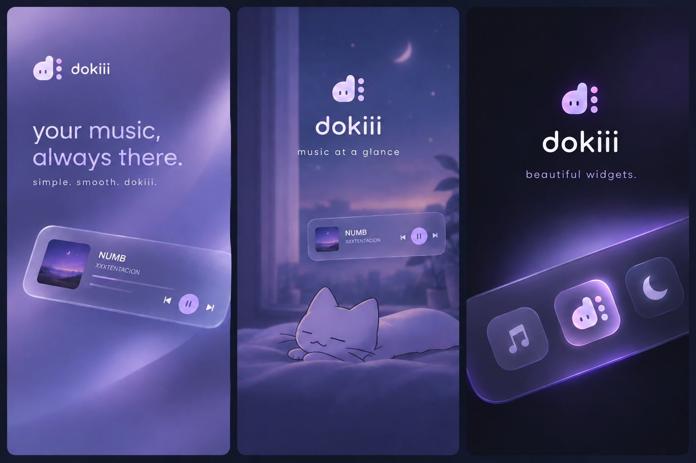
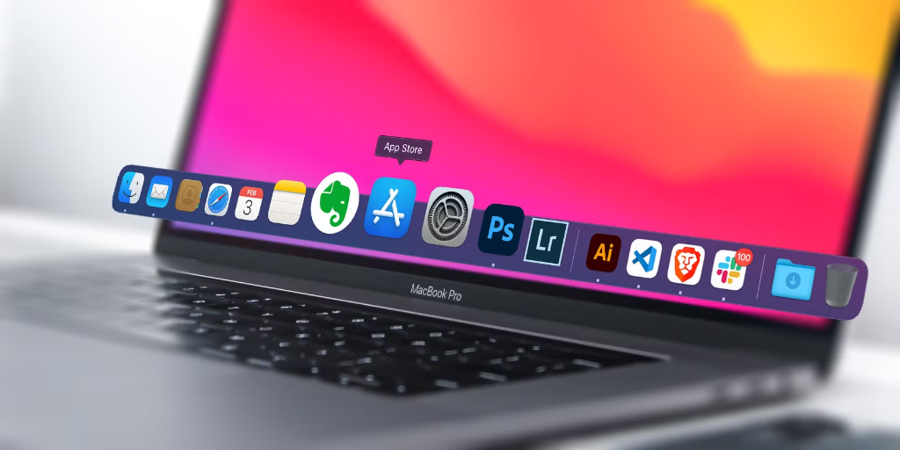
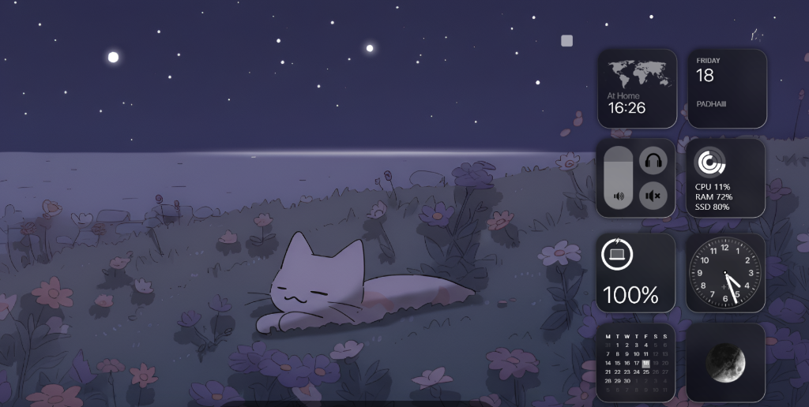
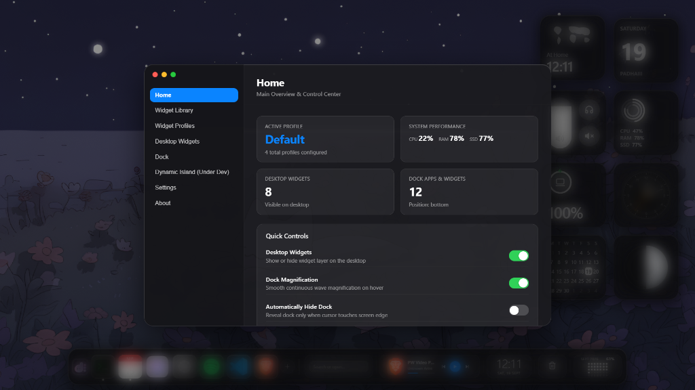

<p align="center">
  
</p>

<h1 align="center">🐾 dokiii</h1>

<p align="center">
  <em>your music, always there.</em><br/>
  A clean macOS-inspired dock, floating music player, and beautiful desktop widgets for Windows.
</p>

<p align="center">
  <a href="https://github.com/fluxonbuzz/dokiii/releases/latest">
    
  </a>
  <a href="https://github.com/fluxonbuzz/dokiii/releases">
    
  </a>
  <a href="LICENSE">
    
  </a>
  
</p>

<p align="center">
  <b>simple. smooth. dokiii.</b> ✨
</p>

---

## ⬇️ Download

<table align="center">
<tr>
<td align="center" width="260">
<a href="https://github.com/fluxonbuzz/dokiii/releases/latest/download/DOKIII.exe">

</a>
<br/><sub>Standalone installer &nbsp;•&nbsp; Windows 10/11 x64</sub>
</td>
<td align="center" width="260">
<a href="https://github.com/fluxonbuzz/dokiii/releases/latest">

</a>
<br/><sub>No install needed &nbsp;•&nbsp; Just unzip and run</sub>
</td>
</tr>
</table>

<p align="center">
  Prefer to see every version? Check the <a href="https://github.com/fluxonbuzz/dokiii/releases">full Releases page</a>.
</p>

---

## 🐱 What It Does

DOKIII brings a smooth, modern desktop experience to Windows:

- **macOS-Style Dock**: An animated bottom or side dock with fluid magnification, app badges, and quick folder access (including your Downloads folder and Trash).
- **DOKIII Halo and Floating Music**: See your current song, artist, and album art from Spotify and Windows media players with one-click playback controls.
- **Desktop Widgets**: Clean, glanceable widgets on your desktop for world time, analog clock, calendar, system health (CPU, RAM, SSD), battery, and volume.
- **Light on Resources**: Engineered to stay around 1-2% idle CPU usage so your PC stays fast and quiet.

## 📸 Screenshots

<p align="center">
  
</p>

<p align="center">
  <em>macOS-style dock with app shortcuts, quick downloads access, and trash</em>
</p>

<br />

<p align="center">
  
</p>

<p align="center">
  <em>Glanceable desktop widgets for system stats, clock, calendar, and battery</em>
</p>

<br />

<p align="center">
  
</p>

<p align="center">
  <em>DOKIII Control Center for customizing widgets, dock magnification, and positions</em>
</p>

---

## 🎀 How to Use

### Getting Started
1. Download `DOKIII.exe` from [Releases](https://github.com/fluxonbuzz/dokiii/releases/latest).
2. Launch the app. The dock and widgets will appear immediately on your desktop.

### Using the Dock
- **Launch Apps**: Click any icon on the dock to open the app.
- **Add Apps**: Click the **+** button on the dock to search installed programs or browse for an `.exe` on your PC.
- **Access Downloads**: Click the downloads folder icon on the right side of the dock to quickly view or open recent files.
- **Move the Dock**: Open Settings to position the dock on the bottom, left, or right edge of your screen.

### Music and Halo
- Play music in Spotify or any Windows media app.
- The floating player and top Halo bar update automatically with track details and album art.
- Click the player to pause, play, or skip tracks. Click outside to collapse.

### Desktop Widgets
- Open the **DOKIII Control Center** by clicking the DOKIII logo or using the system tray icon.
- Toggle desktop widgets on or off with a single switch.
- Choose which widgets you want to show (System Monitor, Clocks, Calendar, Battery, Volume).

---

## 🛠️ Building from Source

If you want to run or build DOKIII locally:

### Requirements
- Windows 10 or 11
- Node.js 18 or newer
- npm

### Quick Start
```bash
git clone https://github.com/fluxonbuzz/dokiii.git
cd dokiii
npm install
npm run dev
```

### Build Executable
```bash
npm run build
npm run pack
```

The packaged executable will be generated in the `release/` directory.

---

## 📄 License

MIT License
